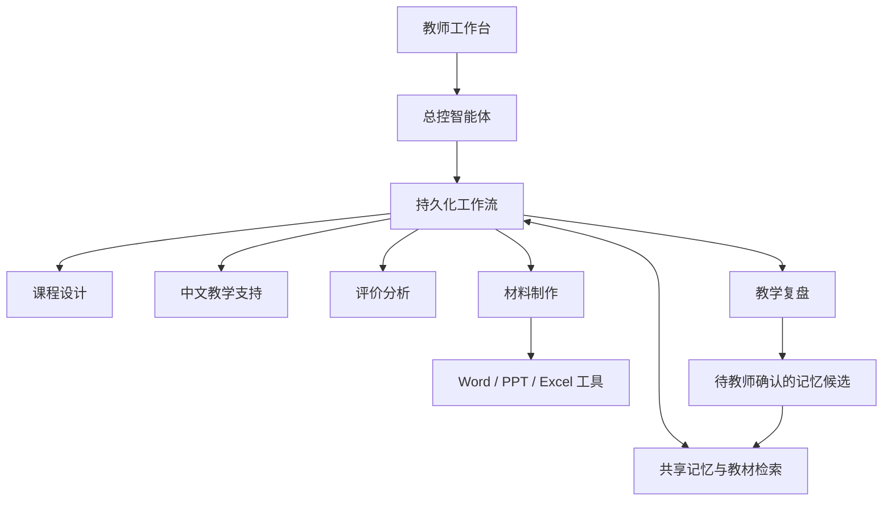

# TCSOL Teacher Agent · 一人教学团队

面向国际中文教师的本地多智能体教学工作台，教学对象为来华学习的外国成人学生。支持 **Windows 与 macOS**。

一个总控智能体协调课程设计、中文教学支持、评价分析、材料制作与教学复盘五个专业岗位。六个岗位可以分别接入不同模型，共用班级、课程和教师确认的教学记忆。

> 当前为原型版本。可以无密钥体验完整流程；演示模板不代表真实模型的教学能力。教学方案、评分和长期学情判断由教师审阅确认。

## 主要功能

- 建立班级与课程，记录成人学习者背景、语言表现、目标和进度。
- 导入 DOCX、文本 PDF、TXT、Markdown 或粘贴文字，选择本课片段并保留来源位置。
- 六智能体分工备课，显示进度、模型、成果、输入依据与待确认问题。
- 编辑目标和练习，同步检查题与材料，保留历史版本和教师采用版本。
- 导出 Word 教案与任务卡、可编辑 PowerPoint 课件、Excel 教学记录。
- 记录课堂表现和匿名学生作业、分数；复盘候选经教师确认后用于下一次备课。
- 分别配置六岗位模型，备份与恢复业务数据。

## 快速开始

### 准备环境

安装 [Node.js](https://nodejs.org/) **24 或更新版本**（包含 npm）。Windows 安装后若命令仍不可用，请重新打开终端。

下载本仓库 ZIP 并完整解压，或执行：

```sh
git clone https://github.com/Jessieimsorry/TCSOL-teacher-agent.git
cd TCSOL-teacher-agent
```

首次安装需要网络，用于获取 npm 依赖。不需要 Python 或 Docker。

### Windows

双击 **`start-windows.bat`**。启动程序检查 Node.js、按需安装依赖、构建页面，并打开 **http://127.0.0.1:8790**。

运行期间保留启动窗口。双击 **`stop-windows.bat`** 正常停止服务，保存任务检查点。支持中文、空格目录，不需要管理员权限，也不需要修改 PowerShell 执行策略。

### macOS

双击 **`启动工作台.command`**，或在项目目录运行 `./启动工作台.command`。在启动窗口按 Control+C，或运行 **`停止工作台.command`** 停止。

### 通用命令

```sh
npm ci
npm run build
npm start
```

开发时用 `npm run dev` 监听后端源码；前端开发另开终端运行 `npx vite`（端口 8791）。后端默认只监听本机地址，不作为公网或多人服务部署。

## 第一次体验

1. 在工作台点击“体验示例课程”，或建立自己的班级与课程。
2. 导入教材并检查提取预览。
3. 在备课室选择课次、课时、教材片段和记忆，选择“演示模板”。
4. 查看和修改教学成果，采用合适版本，导出材料。
5. 上课后填写实际完成情况与困难，等待复盘生成候选。
6. 在记忆中心审阅确认，再准备下一次课。

演示模板主要用于校园请求互动，不自动理解任意主题的自由文字修改。演示与真实课堂记忆分别保存；真实模型失败不会切换为演示成果。

## 模型设置

“设置 → 服务商连接”支持：

| 类型 | 基础地址示例 | 说明 |
|---|---|---|
| OpenAI 兼容接口 | `https://api.openai.com/v1` | 可以填写其他兼容服务商的地址 |
| Anthropic 原生接口 | `https://api.anthropic.com` | 使用 Messages 协议 |
| Ollama 本地接口 | `http://127.0.0.1:11434` | 需要自行安装 Ollama 和准备模型 |

保存连接后可获取模型列表，或手动填写模型标识；连接测试发起一次简短请求。随后在“智能体模型分配”分别选择六岗位模型，或将总控配置应用到全部岗位。

兼容设置可选择 `max_tokens`、`max_completion_tokens` 或不发送长度参数，并关闭不支持的温度参数。任务使用启动时的配置快照；更改设置影响新任务。

## 数据与隐私

业务数据与源码分开保存：

| 系统 | 默认目录 |
|---|---|
| Windows | `%LOCALAPPDATA%\ChineseTeachingTeam` |
| macOS | `~/Library/Application Support/ChineseTeachingTeam` |
| Linux | `$XDG_DATA_HOME/ChineseTeachingTeam`，未设置时为 `~/.local/share/ChineseTeachingTeam` |

可以通过 `CTT_DATA_DIR` 指定其他目录。Windows 文件访问权限由当前用户的数据目录权限控制；Mac/Linux 的密钥文件设为仅当前用户读写。

- API 密钥由后端以 AES-256-GCM 加密保存，不回传页面，也不进入普通备份。主密钥仍保存在本机，请保护数据目录。
- 云端推理会发送当前任务需要的教材片段、匿名学情和记录给所选服务商；本地运行不等于完全离线。
- 导入教材前检查版权和个人信息。不要向公开仓库提交真实学生名单、成绩、教材原件、密钥或数据备份。
- 备份包含教材原件、任务、版本、记录和记忆，不含模型密钥。恢复前保存业务快照，恢复后需重新填写密钥。
- `.gitignore` 排除运行数据、数据库、密钥、日志、测试目录与本地截图。

## 架构



React、TypeScript、Vite 前端；Node.js、Fastify 后端；SQLite 保存任务、版本和记忆，采用中文分词全文检索。专业规则位于 `agents/`，岗位与模型分开配置。输出经过 Zod 校验，智能体不能执行任意生成的代码。

任务可暂停、取消和继续。服务重启不自动重复模型请求。文件从同一版本的教学包生成；学生任务卡不含答案，学生课件不含教师专用页和备注。外部 Office 修改暂不自动回流。

## 测试与当前边界

```sh
npm test
npm run build
```

GitHub Actions 在 Windows、macOS 和 Linux 上执行构建与系统测试，并在 Windows 上检查实际服务启动与正常停止。测试用临时数据和模拟模型，不使用真实学生数据或密钥；具体运行结果见仓库 Actions。

当前不包含扫描件 OCR、音频生成、学生在线练习、完整考勤、多人账号和外部平台同步。真实模型质量、中文自然度、成人任务适配与教学效果需实际课程试用确认。

## 更新

Git 用户运行 `git pull`，随后 `npm ci`、`npm run build` 并重启服务。ZIP 用户下载新版源码，保留独立数据目录。软件不会自动更新。
